<h1>Pertanyaan 1.2.1</h1>
Source Code :  
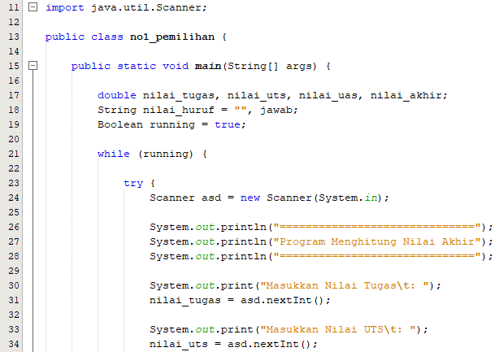 
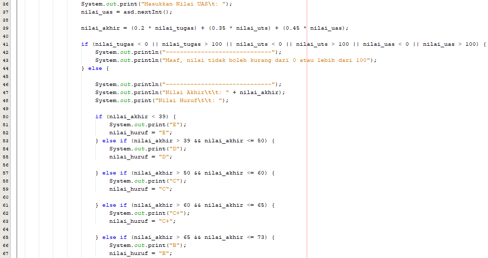 
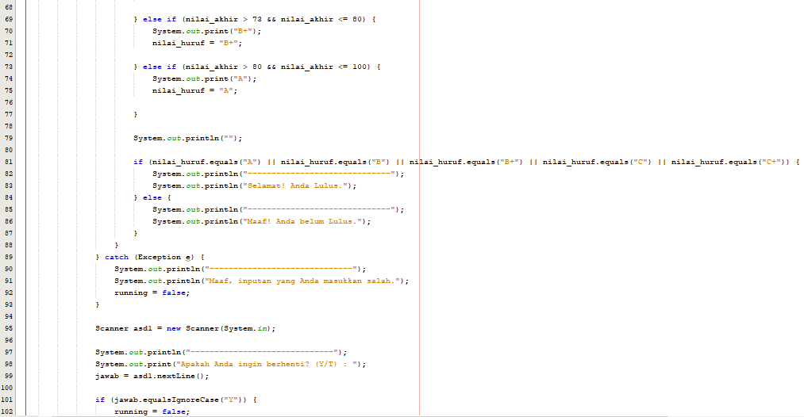 
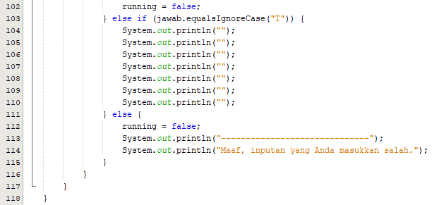 
Output :  
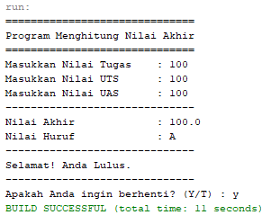 

<h1>Pertanyaan 1.3.1</h1>
Source Code :  
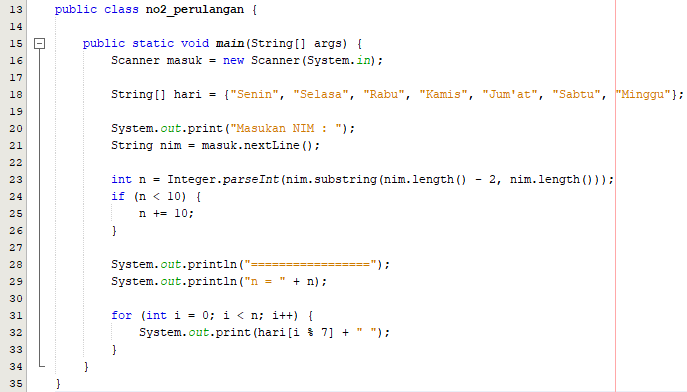 
Output :  
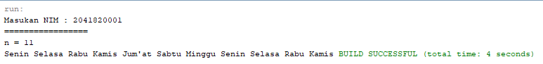 

<h1>Pertanyaan 1.4.1</h1>
Source Code :  
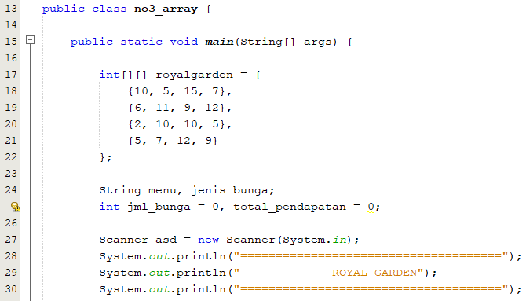 
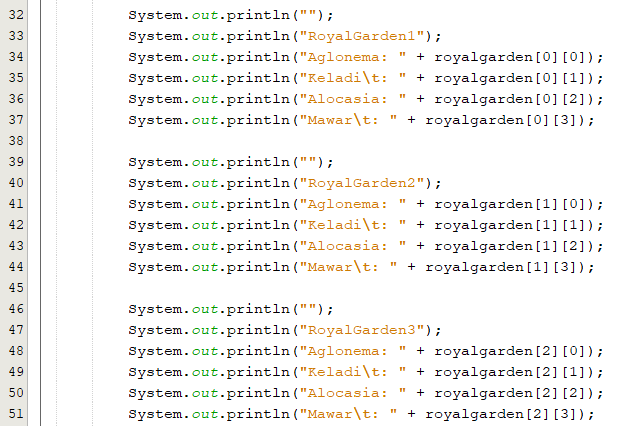 
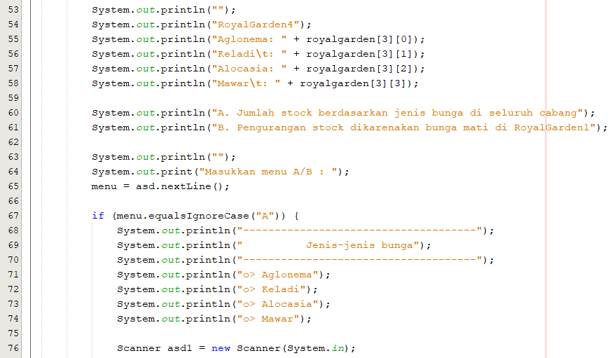 
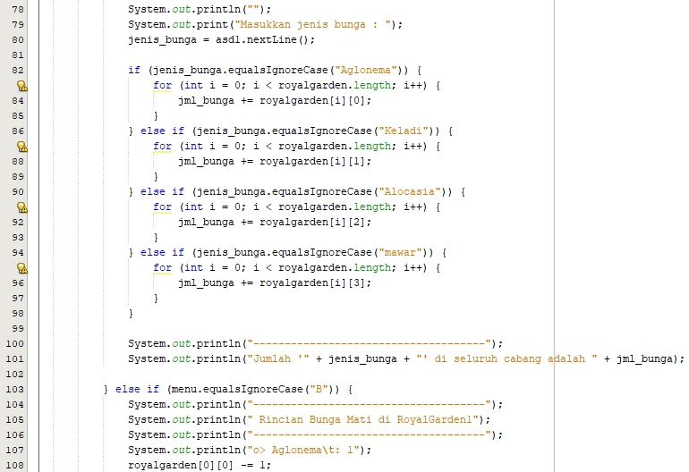 
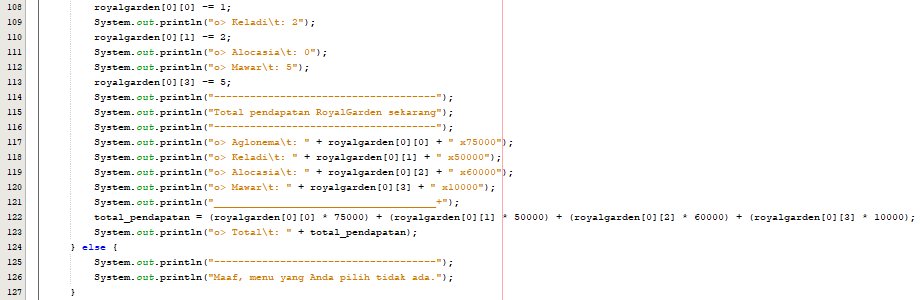 
Output :  
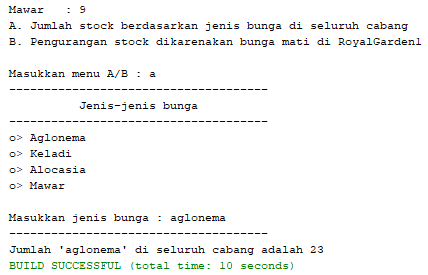 

<h1>Pertanyaan 1.5.1</h1>
Source Code :  
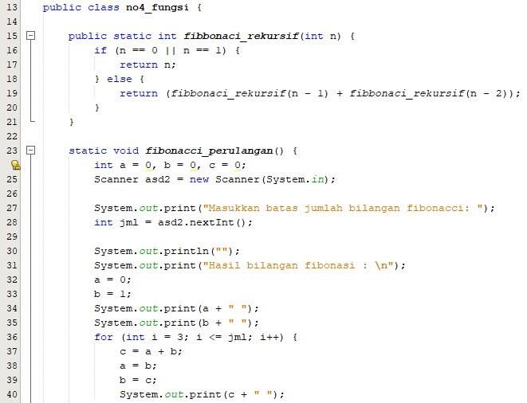 
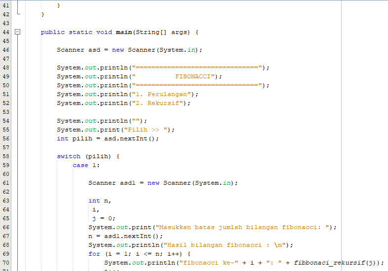 
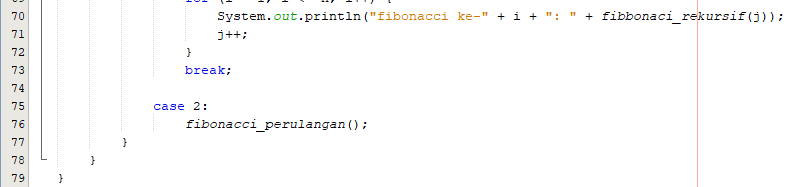 
Output :  
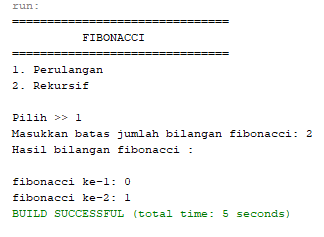 

<h1>Tugas</h1>
<h3>Nomer 1<h3> 
Source Code :  
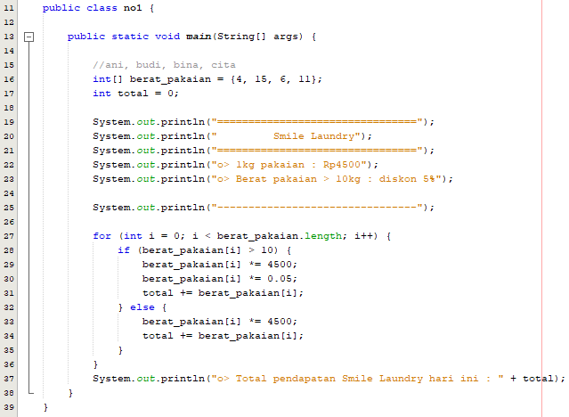 
Output :  
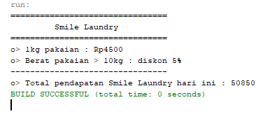 

<h3>Nomer 3</h3> 
Source Code :  
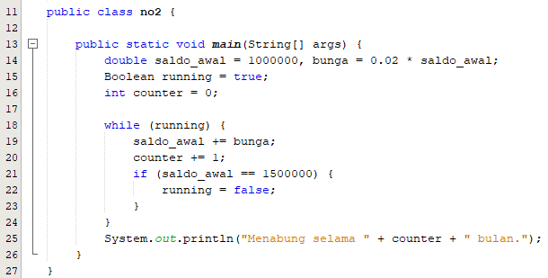 
Output :  
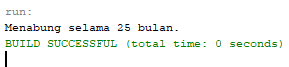 

<h3>Nomer 4</h3> 
Source Code :  
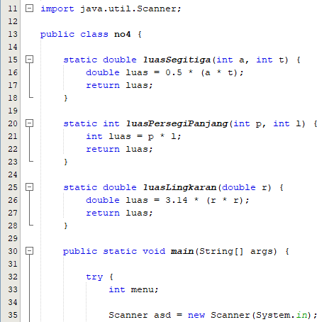 
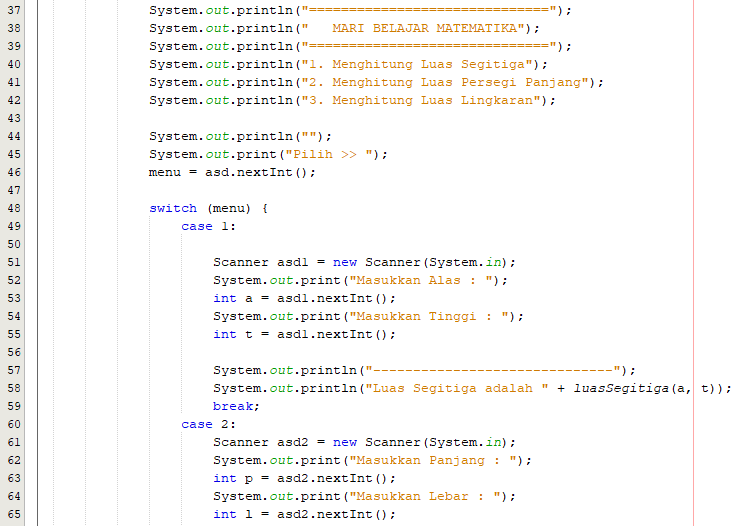 
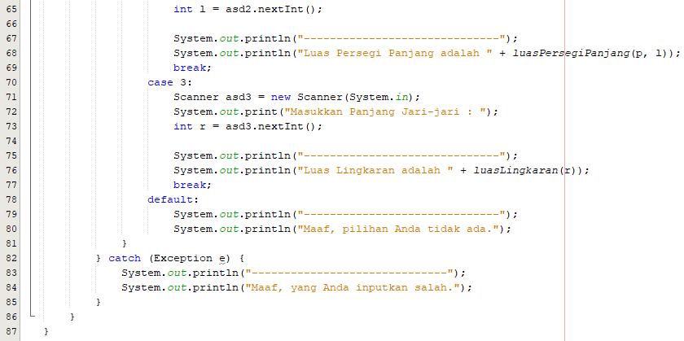 
Output :  
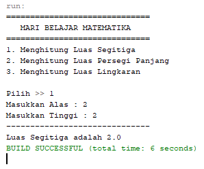 