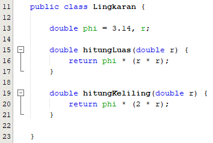
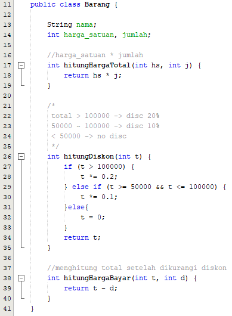

Nama : Meliusa Nora Hariyanti 
Nim : 2041720084 
Kelas : TI-1H 
Absen : 17 

Source Code Latihan Jobsheet 2-- 

Barang.java 
 
 

BarangMain.java 
 

Output 
 

--Source Code Jobsheet 2-- 

1. Lingkaran.java 
 

no1.java 
 
 

Output  
 

2. Peminjaman.java 
 
 
 

no2.java 
 
 

Output 
 

3. Barang.java 
 

no3.java
 
 
 

Output 
 

4. PacMan.java 
 
 

no4.java 
 
 

Output  
 

