<h1>Pertanyaan 2.2.3</h1>
1. Memiliki atribut dan method 
2. class 
3. ada 4 yaitu String namaBrang, jenisBarang, int stok, hargaSatuan 
4. ada 4 yaitu  
    1) tamilBarang(), >> untuk menampilkan data barang 
    2) tambahStok(int n), >> menambah stok barang 
    3) kurangiStok(int n), >> mengurangi stok barang 
    4) hitungHargaTotal(int jumlah) >> menghitung total dari jumlah pembelian barang 
5. 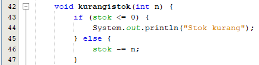 
6. karena atribut yang melibatkan hitungHargaTotal() bertipe data int 
7. karena untuk penjumlahan aritmatika 
8. karna tidak mengembalikan nilai 

<h1>Pertanyaan 2.3.3</h1>
1. Pada baris ke 15 , nama objek yang di hasilkan adalah b1 
2. cara mengakses atribut dan method dengan cara , nama_objek.atribut / nama_objek.method. misal : b1.namaBarang = "Hijab"; 

<h1>Pertanyaan 2.4.3</h1>
1. Baris 18 hingga 23 
2. Membuat objek baru dengan menggunakan konstruktor berparameter 
3.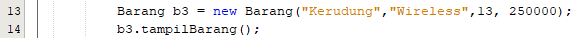 

<h1>Latian Praktikum</h1>
<h3>nomer 1</h3> 
Lingkaran.java 
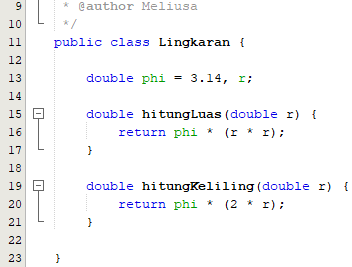 
no1.java 
Source Code :  
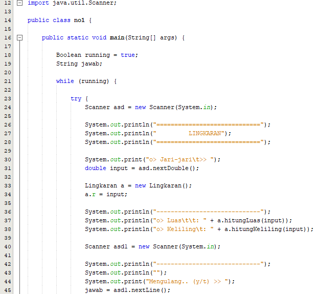 
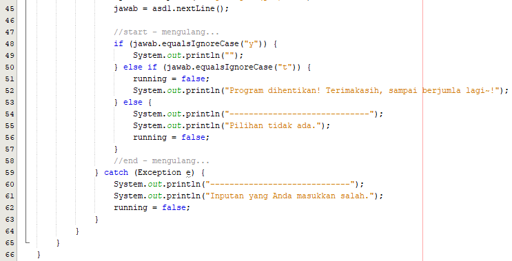 
Output :  
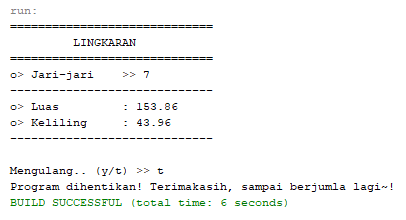 

<h3>nomer 2</h3> 
Peminjaman.java 
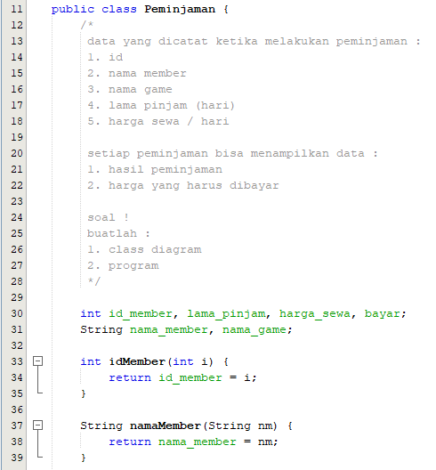 
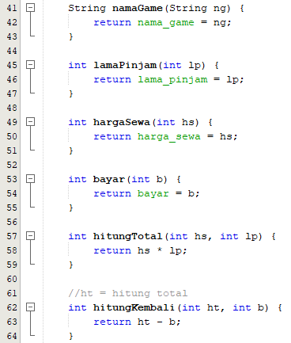 
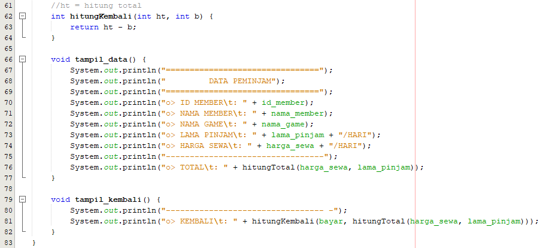 
no2.java 
Source Code :  
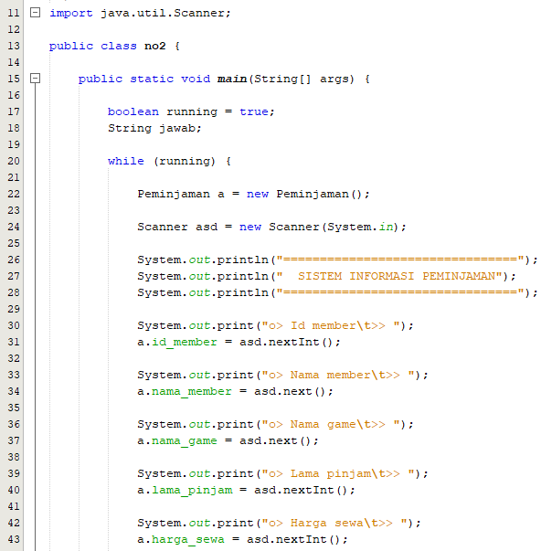 
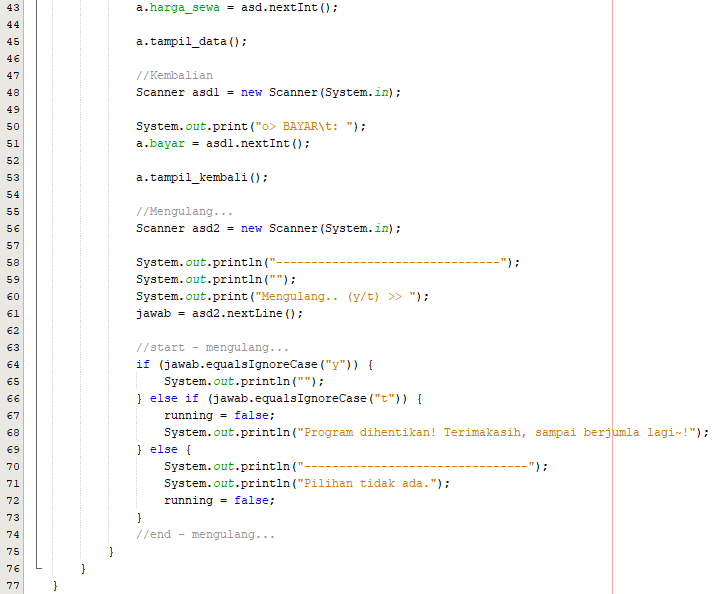 
Output :  
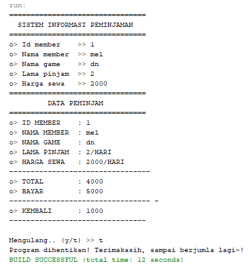 

<h3>nomer 3</h3> 
Barang.java 
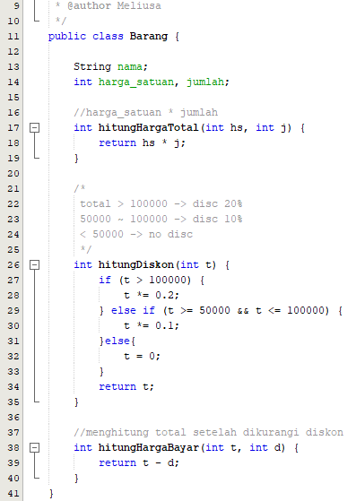 
no3.java 
Source Code :  
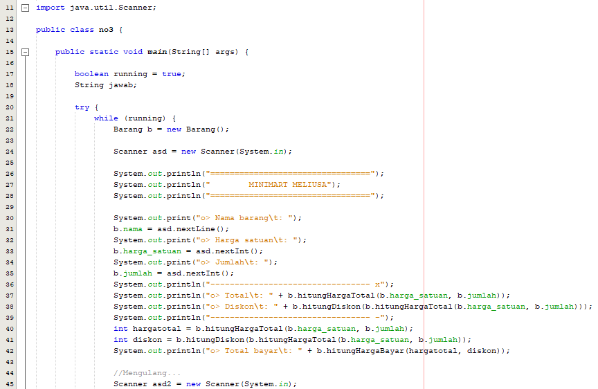 
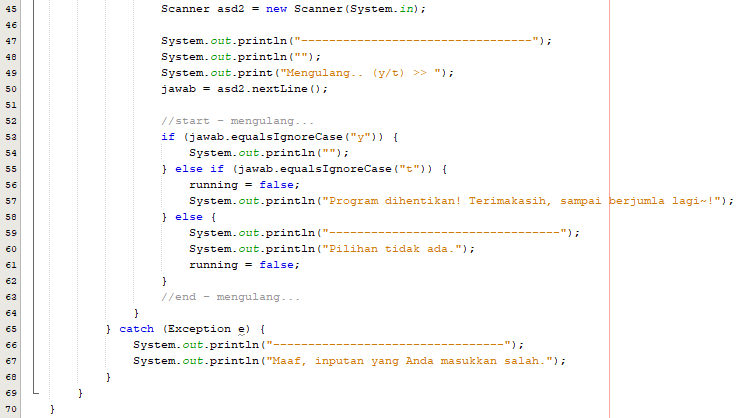 
Output :  
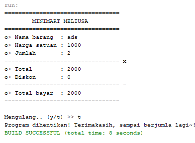 

<h3>nomer 4</h3> 
PacMan.java 
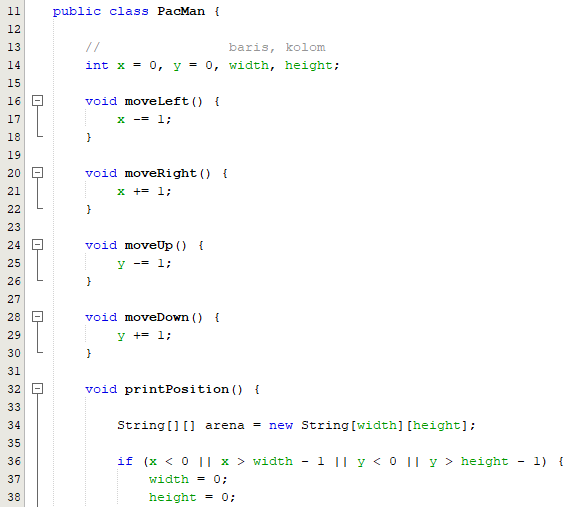 
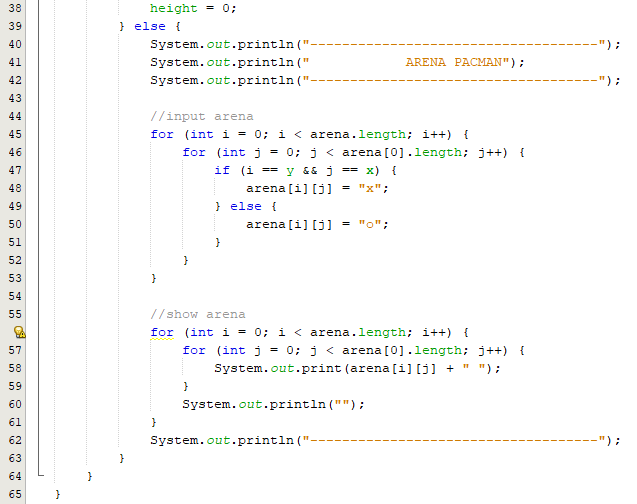 
no4.java 
Source Code :  
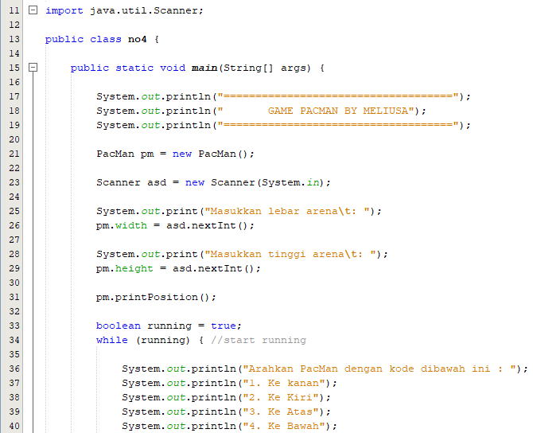 
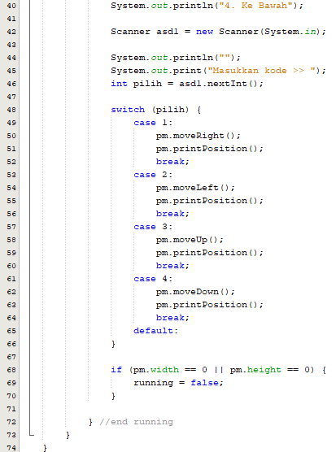 
Output :  
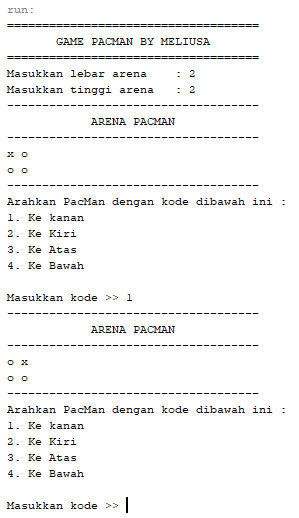 

