<h1>Pertanyaan 3.2.3</h1> 
1. Harus ada atribut karena format pemanggilan array of objek di class main harus ada variabel dari instansiasi dan atribute dari class yang di instansiasi 
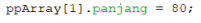 
2. Tidak, coding tersebut hanya untuk instansiasi array of objek saja 
3. Instansiasi array of objek 
4. Memberi nilai pada atribut melalui array of objek 
5. Supaya konsep yang dijalankan jelas, tidak rancu 

<h1>Pertanyaan 3.3.3</h1>
1. Bisa 
2. namaclass[][] var = new namaclass[0][0] 
3. karena perlu instansiasi sebelum diisikan objek-objek di dalamnya 
4. 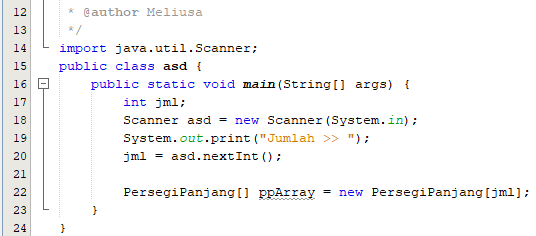 
5. Boleh, terdapat nilai yang berbeda pula nantinya. tergantung value di dalam parameter 

<h1>Pertanyaan 3.4.3</h1>
1. Bisa, karena ada program yang membutuhkan konstruktor berparameter dan ada juga yang membutuhkan konstruktor tidak berparameter 
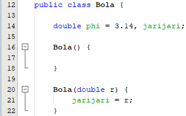 
2. 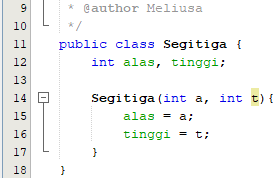 
3. 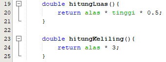 
4. 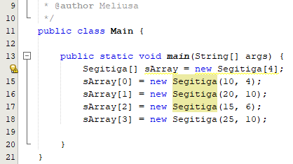 
5. Source Code :  
 
Output :  
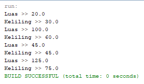 

<h1>Latihan Praktikum</h1>
<h3>nomer 1</h3> 
Bola.java 
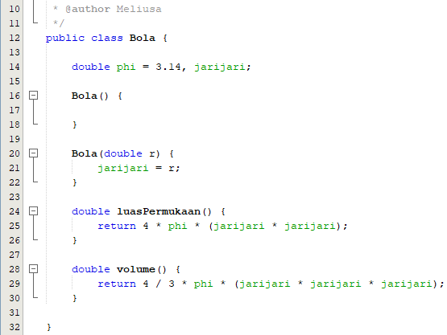 
Kerucut.java 
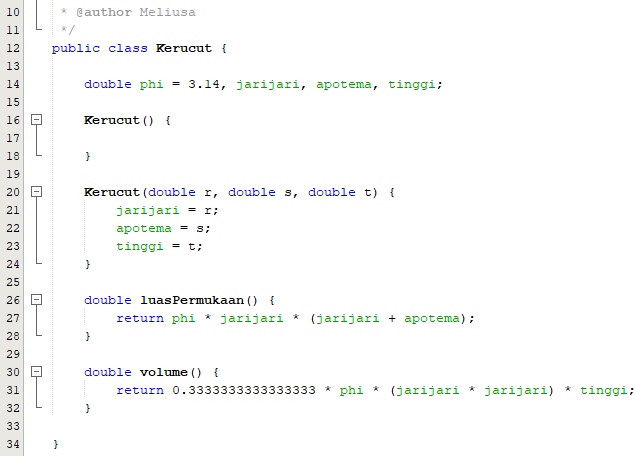 
Kubus.java 
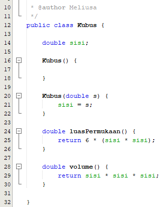 
no1.java 
Source Code :  
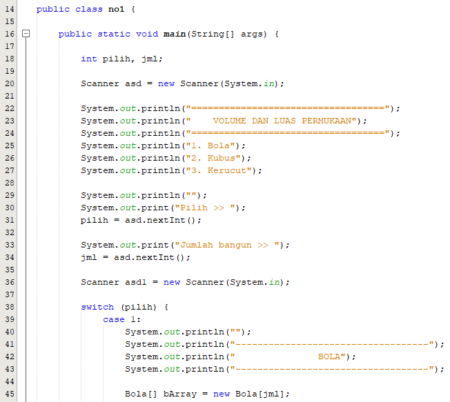 
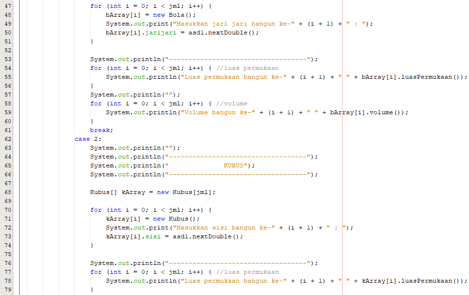 
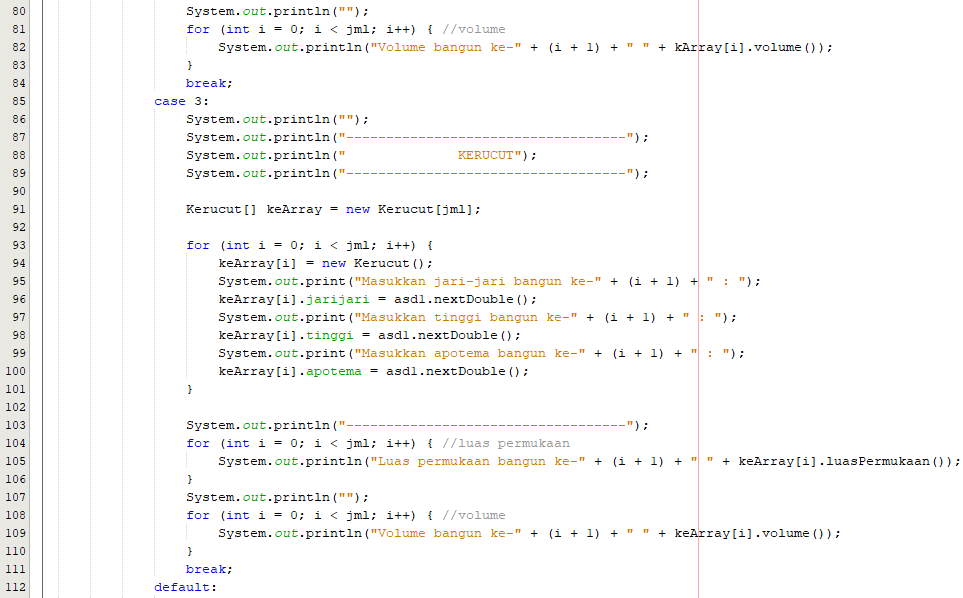 
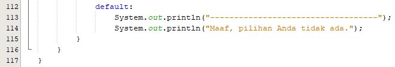 
Output :  
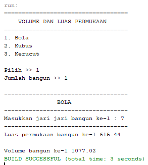 

<h3>nomer 2</h3> 
LuasTanah.java 
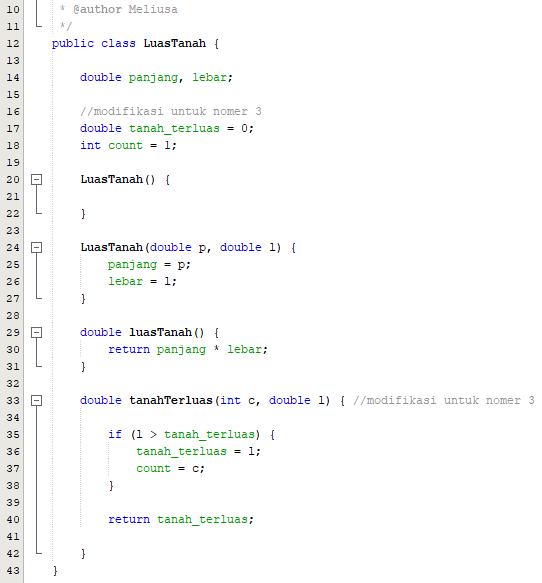 
no2.java 
Source Code :  
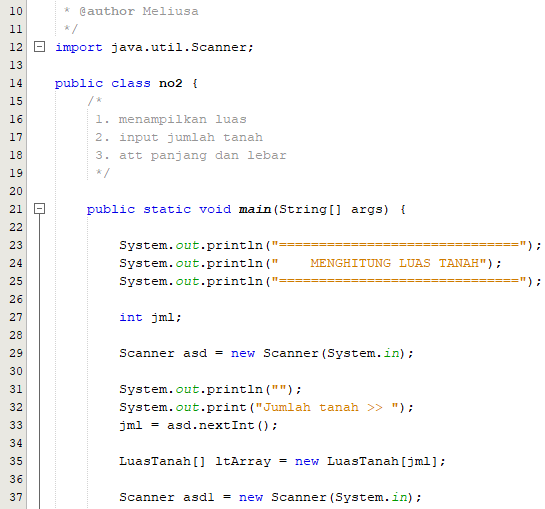 
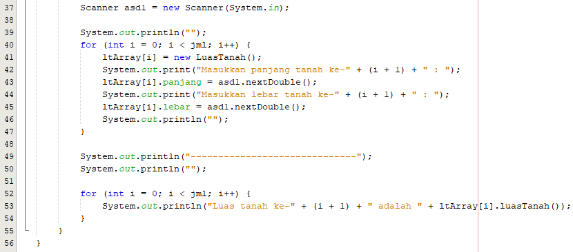 
Output :  
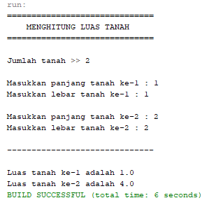 

<h3>nomer 3</h3> 
LuasTanah.java 
 
no3.java 
Source Code :  
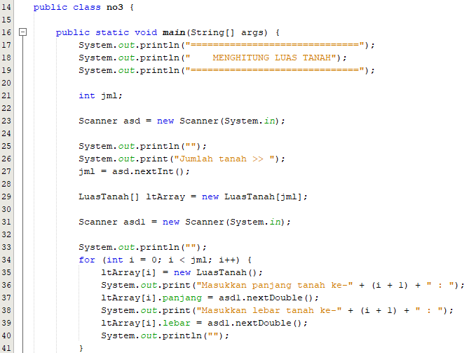 
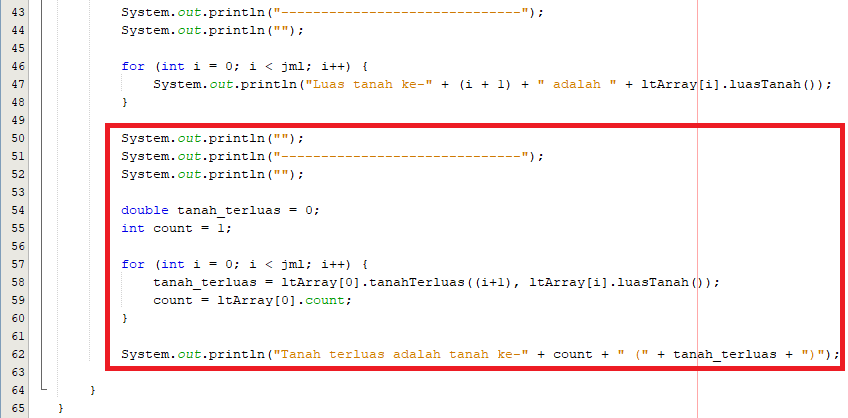 
Output :  
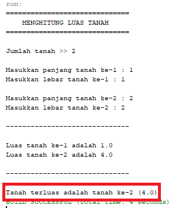 

<h3>nomer 4</h3> 
Mahasiswa.java 
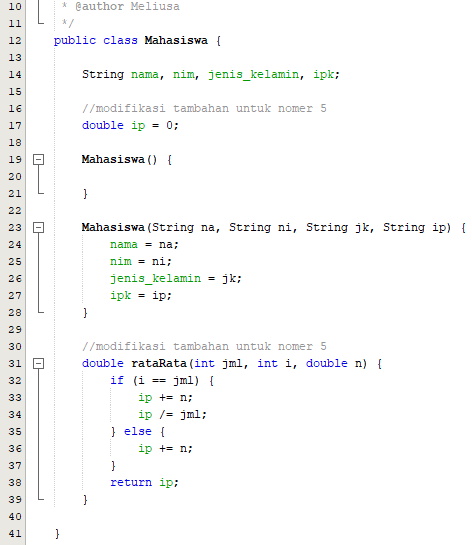 
no4.java 
Source Code :  
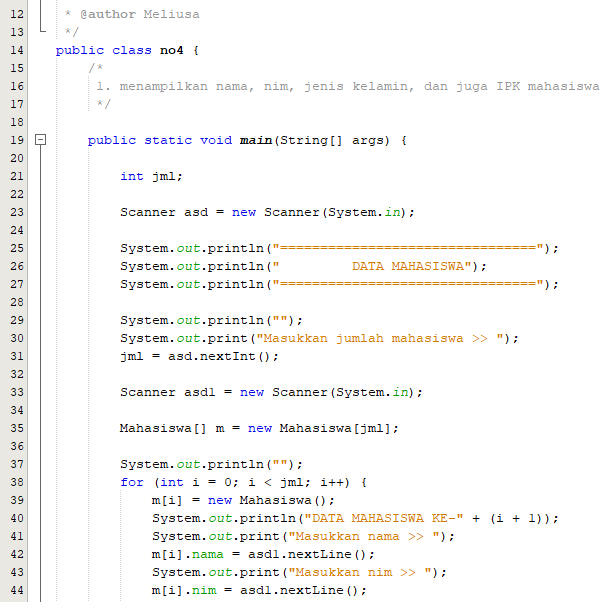 
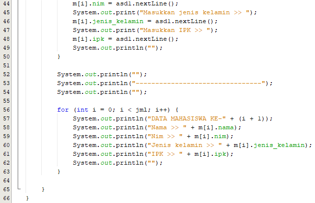 
Output :  
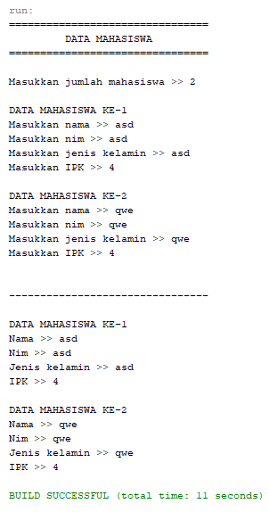 

<h3>nomer 5</h3> 
Mahasiswa.java 
 
no5.java 
Source Code :  
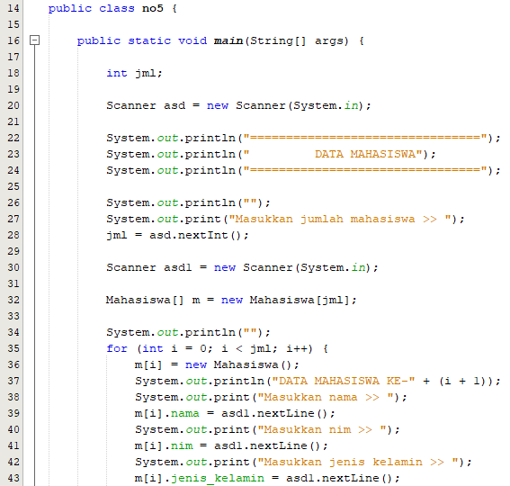 
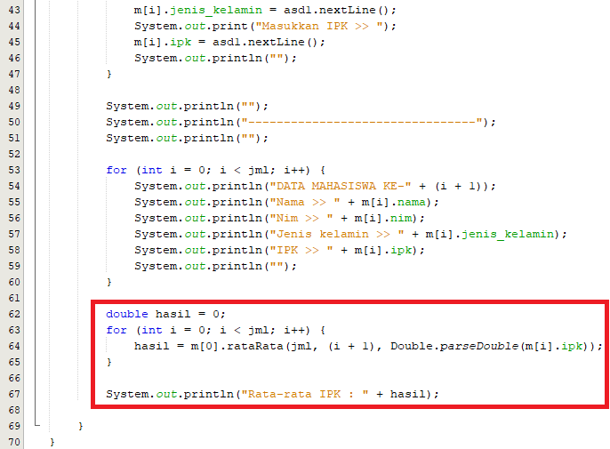 
Output :  
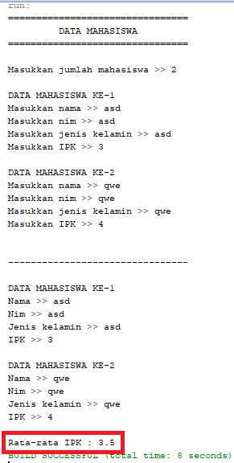 
