2041720084 - Meliusa Nora Hariyanti 

<h2>Pertanyaan 5.2.3</h2>
1. Method bubbleSort() 
2. Tidak ada. 
3. Proses swap adalah pertukaran nilai 
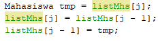 
4. Proses swap atau pertukaran 
5. a) Perulangan i berguna untuk mengulang seluruh data yang akan diulang sebanyak panjang dari array tersebut. Perulangan j berguna untuk proses swap. 
b) Karena array dibaca dari indeks 0. 
c) Karena proses swap dari bubbleSort adalah membandingkan dengan angka sebelumnya. 
d) Perulangan i berlangsung sebanyak 50x (dibaca dari indeks 0) dan tahap bubbleSort yang ditempuh adalah 2500x. 

<h2>Pertanyaan 5.3.3</h2>
Untuk mengecek, apakah nilai dari listMhs[i].ipk lebih kecil dari listMhs[idxMin].ipk 
Jika iya, maka nilai dari idxMin di isi dengan nilai dari variabel j 

<h2>Pertanyaan 5.4.3</h2>
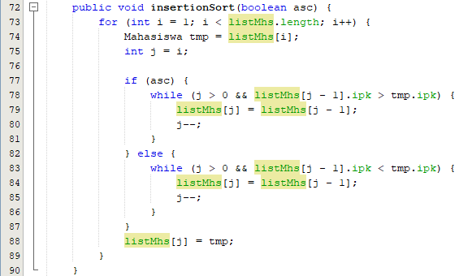 

<h2>Tugas</h2>
No.1 
Tiket.java 
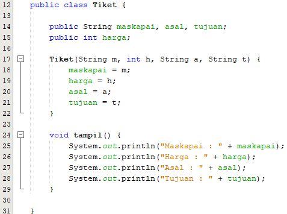 
TiketService.java 
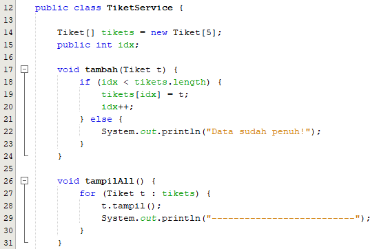 
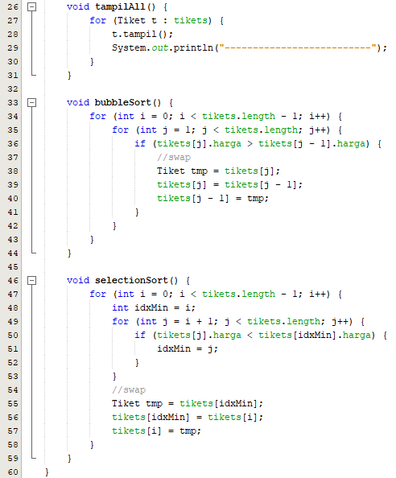 
MainTiket.java
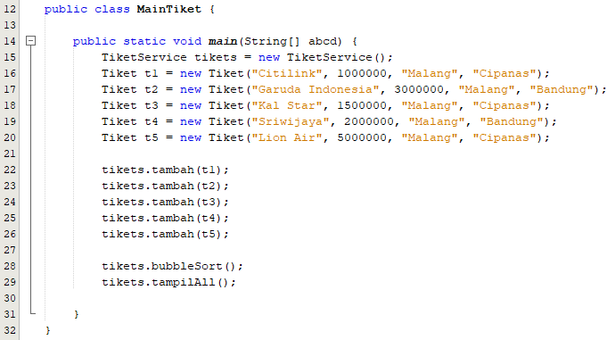 
Output : 
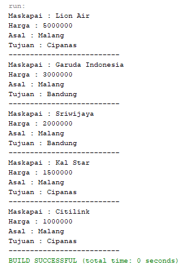 

No.2 
PremierLeague.java 
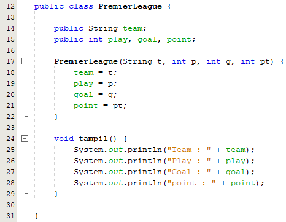 
PremierLeagueService 
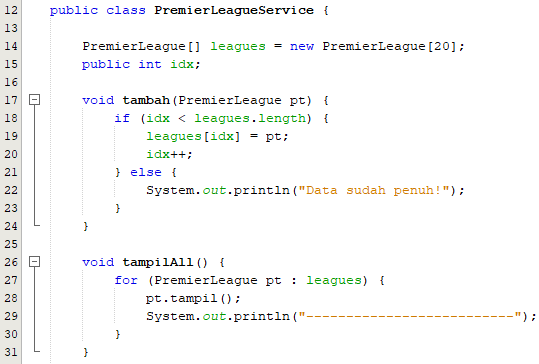 
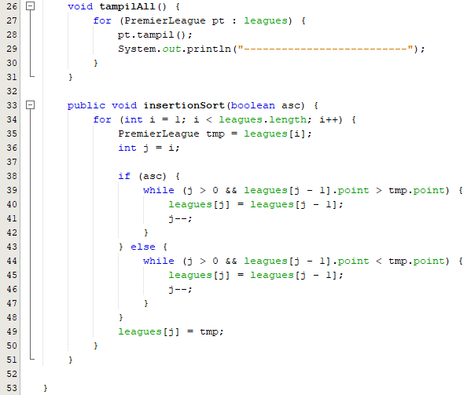 
MainLeague.java 
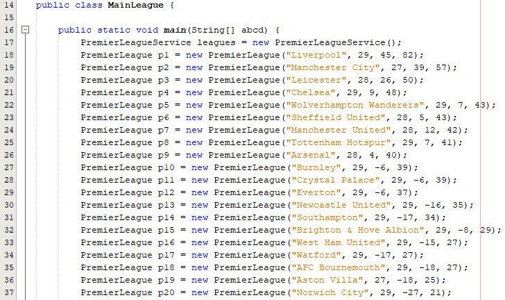 
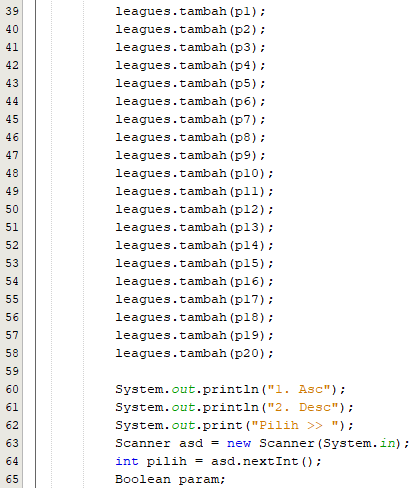 
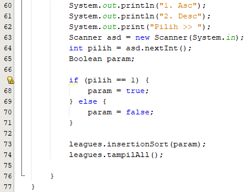 
Output : 
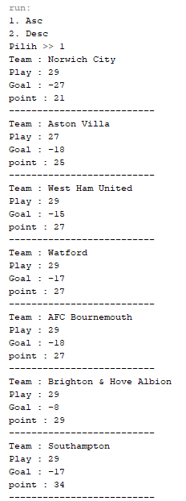 
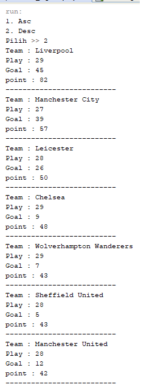 

